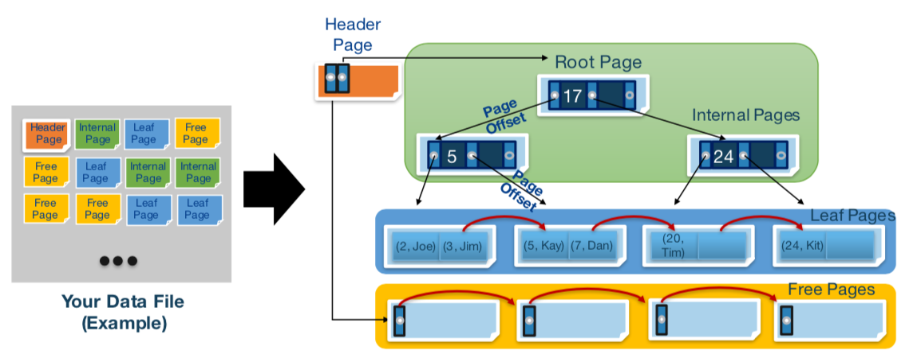
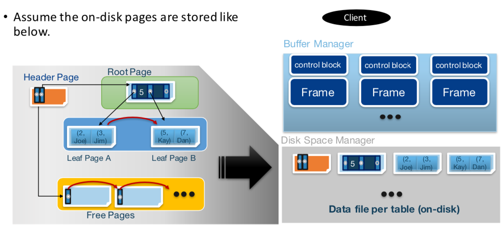
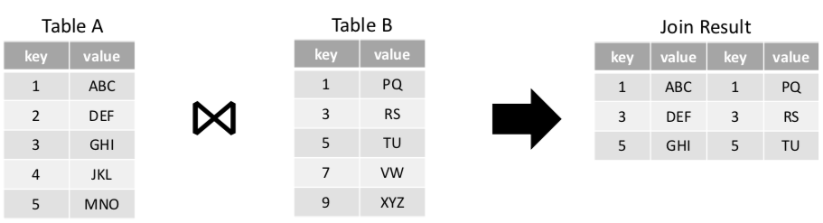
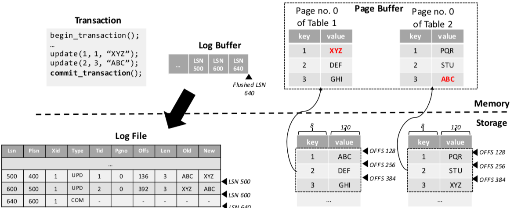

# Disk Based B+ Tree
original BPT source code is written by Amittai Aviram (http://www.amittai.com)

modified by Dae In Lee

## Projects

* **[Project1](./project1)**<br>SQL queries test.

* **[Project2 - Disk-based B+ Tree](./project2)**<br>Basic Disk-based B+ Tree Implementation. Check [Features](#features) for more information.<br>

* **[Project3 - Buffer Manager](./project3)**<br>Implement in-memory buffer manager to cache on-disk pages.<br>Adding buffer layer to B+ Tree significantly enhances overall [performance of data structure](#performance).<br>

* **[Project4 - Natural Join](./project4)**<br>Implement new function `int join_table(int table_id_1, int table_id_2, char* path_name);`<br>This function does natural join with given two tables and write result table to the file with given `path_name`.<br>It returns 0 if success, otherwise return non-zero value.<br>Note that two tables for the join must be opened before calling the function.<br>

* **[Project5 - Log Manager](./project5)**<br>Implement log manager to support transaction & recovery from the crashes.<br>Log manager satisties...
  
  * No Force (REDO) & Steal (UNDO) policy
  * Write Ahead Logging (WAL)
  * Recovery happen during the initializing DB if crashed eariler.
  
  Check [here](#recovery) for some information.
  
  

# Features

This project implemented B+ Tree data structure to construct single-user diskbased DB.

Each "data" is constructed with <key:value> pair.

The following commands are available to manipulate DB.

```c++
init_db(num_buf);
shutdown_db();
open_table(pathname);
close_table(table_id);
```

The following commands are available to insert, delete or search data.

```c++
print_tree(table_id);
find(table_id, key);
find_and_print(table_id, key);
insert(table_id, key, value);
delete(table_id, key);
join_table(table_id_1, table_id_2, pathname);
```

The following commands are available to support transaction APIs.

```c++
begin_transaction();
commit_transaction();
abort_transaction();
```

* **You must initialize DB** by calling init_db(num_buf).
Number of buffers to be used will be decided according to the num_buf variable.
* each DB(program) can open up to 10 tables by calling open_table(pathname).
you must open at least one table before any command execution.
* If *toggle_bs* from *page.h* is set true and num_buf >= 100, program will use
binary search algorithm for the buffer management.
It may decrease the performance of DB if insertion/deletion is the majority of operation
thus it is set to false as default.
* data is sorted and stored into B+ tree by key
* key is int64_t type, and value must be less than 120 characters
* Each internal page can hold up to 248 entries(child page)
* Each leaf page can hold up to 31 recordes.
* Hash Table has been implemented for the buffer manager.
It significiently increase the performance of buffer manager compare to linear/binary search with any given set of commands. Check performace for more info.
* Join_table function will do **equi-join** using **sort-merge join**. Since both tables are already sortred,
sorting process is not required. Therefore avg. time complexity of join_table is O([R] + [S]).


# Code Guidance

please check [bpt.pdf](./bpt.pdf) for more information about the codes and implementation.


# Recovery

Only "update" function works for recovery. Almost done insertion & deletion but something messed up with deletion and ultimatly failed on even with isertion & update. So I had to roll back to update only recovery.
Should have committed insertion finished files...

The format of the db file must be DATA1 ~ DATA10, and it must be present at the same directory with program main file. Recovery won't work if not.

log data is saved as "log.db"

Recovery is done based on "physical recovery" Compare the leaf page lsn to the log lsn, if log lsn has higher value, do recovery. (Undo is vice versa)

Unlike most of students, I used "double linked list" to manage the inmemory logs. In this way, log is flushed into the disk only when it has to(steal: when buffer manager flushes buffer, no force:at the time of commit).

There is no CLE type log but however, abort txn will use END / UPDATE log type to finish undo.


# Performance

## Insertion Performance


## Deletion Performance


As you can see from the chart, any kind of buffer implementation enhances performance to 1.3 ~ 12 times depending on the workload.

I've tried 3 diffrent search algorithm for Buffer Manager.

* Naive Linear Search Algorithm

	The problem with linear search algorithm is that it ALWAYS search ALL the buffers to find if matching buffer frame exists. Thus it takes O( N ).
	If the # of buffer frames goes big, the overhead of searching decrease the 	performance significantly.


* Binary Search Algorithm

	Binary Search algorithm is what I came up after linear search. Binary Search algorithm takes only O ( lgN ) for search.
	But in order to use binary search on the array, array must be in sorted form.
	And if buffer is nearly full, overhead to keep array in sorted form decrease the performance since it takes O ( size ) to sort the array.

* Hash Table
	
	It was hard to consider how to implement hash table for the buffer management.
	If the hash table is fully created, the size of hash table exceeds the size of buffer pool. Thus the size of hash table is set to the size of buffer pool. And chaining hash table was implemented.
	Since linked list does not ensure the consecutive memory allocation, and it always have to allocate/free memory. The overhead of hash table may exceed other implementation with small buffer pool size. But it is off by a little.
	And if the size of buffer pool gets bigger and bigger, the performance of hash table is unmatachable to any other implementation.
	Therefore, hash table is the final solution I've came up with.

Please check below for the further data.

Test Environment : Mid-2013 Macbook Air with SSD

Following tests were done with O_SYNC flag on.

The current project3 pushed to git does not have O_SYNC flag thus the speed of any write operation is much faster.

Test code(python) was provided by CheonChangGeun.

### Project2 - No Buffer
	-------------- sequential Insert Test --------------
	Large(2^20) Test
	Result: 1048576/1048576 (100.00) 218.19 secs
	--------------   Random Insert Test   --------------
	Large(2^20) Test
	Result: 1048576/1048576 (100.00) 201.09 secs
	--------------      Delete Test       --------------
	Delete All Records sequential
	Result: 1048576/1048576 (100.00) 175.17 secs
	Delete All Records Reversal
	Result: 1048576/1048576 (100.00) 201.31 secs
	Random_Delete_ALL(2^20) Test
	Result: 1048576/1048576 (100.00) 260.35 secs

### Project3 - 16 Buffer Pool with Linear Search
	-------------- Sequential Insert Test --------------
	Large(2^20) Test
	Result: 1048576/1048576 (100.00) 43.47 secs
	--------------   Random Insert Test   --------------
	Large(2^20) Test
	Result: 1048576/1048576 (100.00) 188.41 secs
	--------------      Delete Test       --------------
	Delete All Records Sequential
	Result: 1048576/1048576 (100.00) 19.48 secs
	Delete All Records Reversal
	Result: 1048576/1048576 (100.00) 32.29 secs
	Random_Delete_ALL(2^20) Test
	Result: 1048576/1048576 (100.00) 191.25 secs

### Project3 - 160 Buffer Pool with Linear Search
	-------------- Sequential Insert Test --------------
	Large(2^20) Test
	Result: 1048576/1048576 (100.00) 35.27 secs
	--------------   Random Insert Test   --------------
	Large(2^20) Test
	Result: 1048576/1048576 (100.00) 197.66 secs
	--------------      Delete Test       --------------
	Delete All Records Sequential
	Result: 1048576/1048576 (100.00) 25.02 secs
	Delete All Records Reversal
	Result: 1048576/1048576 (100.00) 19.02 secs
	Random_Delete_ALL(2^20) Test
	Result: 1048576/1048576 (100.00) 209.83 secs

### Project3 - 1600 Buffer Pool with Linear Search
	-------------- Sequential Insert Test --------------
	Large(2^20) Test
	Result: 1048576/1048576 (100.00) 106.96 secs
	--------------   Random Insert Test   --------------
	Large(2^20) Test
	Result: 1048576/1048576 (100.00) 300.40 secs
	--------------      Delete Test       --------------
	Delete All Records Sequential
	Result: 1048576/1048576 (100.00) 18.88 secs
	Delete All Records Reversal
	Result: 1048576/1048576 (100.00) 82.26 secs
	Random_Delete_ALL(2^20) Test
	Result: 1048576/1048576 (100.00) 329.03 secs

### Project3 - 16 Buffer Pool with Binary Search
	-------------- Sequential Insert Test --------------
	Large(2^20) Test
	Result: 1048576/1048576 (100.00) 41.16 secs
	--------------   Random Insert Test   --------------
	Large(2^20) Test
	Result: 1048576/1048576 (100.00) 164.46 secs
	--------------      Delete Test       --------------
	Delete All Records Sequential
	Result: 1048576/1048576 (100.00) 25.49 secs
	Delete All Records Reversal
	Result: 1048576/1048576 (100.00) 29.77 secs
	Random_Delete_ALL(2^20) Test
	Result: 1048576/1048576 (100.00) 206.10 secs

### Project3 - 160 Buffer Pool with Binary Search
	-------------- Sequential Insert Test --------------
	Large(2^20) Test
	Result: 1048576/1048576 (100.00) 33.19 secs
	--------------   Random Insert Test   --------------
	Large(2^20) Test
	Result: 1048576/1048576 (100.00) 170.24 secs
	--------------      Delete Test       --------------
	Delete All Records Sequential
	Result: 1048576/1048576 (100.00) 26.08 secs
	Delete All Records Reversal
	Result: 1048576/1048576 (100.00) 16.65 secs
	Random_Delete_ALL(2^20) Test
	Result: 1048576/1048576 (100.00) 181.39 secs

### Project3 - 1600 Buffer Pool with Binary Search
	-------------- Sequential Insert Test --------------
	Large(2^20) Test
	Result: 1048576/1048576 (100.00) 35.84 secs
	--------------   Random Insert Test   --------------
	Large(2^20) Test
	Result: 1048576/1048576 (100.00) 184.18 secs
	--------------      Delete Test       --------------
	Delete All Records Sequential
	Result: 1048576/1048576 (100.00) 17.50 secs
	Delete All Records Reversal
	Result: 1048576/1048576 (100.00) 18.70 secs
	Random_Delete_ALL(2^20) Test
	Result: 1048576/1048576 (100.00) 174.62 secs

### Project3 - 16 Buffer Pool with Hash Table
	-------------- sequential Insert Test --------------
	Large(2^20) Test
	Result: 1048576/1048576 (100.00) 42.65 secs
	--------------   Random Insert Test   --------------
	Large(2^20) Test
	Result: 1048576/1048576 (100.00) 168.77 secs
	--------------      Delete Test       --------------
	Delete All Records sequential
	Result: 1048576/1048576 (100.00) 20.47 secs
	Delete All Records Reversal
	Result: 1048576/1048576 (100.00) 22.30 secs
	Random_Delete_ALL(2^20) Test
	Result: 1048576/1048576 (100.00) 186.89 secs

### Project3 - 160 Buffer Pool with Hash Table
	-------------- sequential Insert Test --------------
	Large(2^20) Test
	Result: 1048576/1048576 (100.00) 37.51 secs
	--------------   Random Insert Test   --------------
	Large(2^20) Test
	Result: 1048576/1048576 (100.00) 181.51 secs
	--------------      Delete Test       --------------
	Delete All Records sequential
	Result: 1048576/1048576 (100.00) 20.17 secs
	Delete All Records Reversal
	Result: 1048576/1048576 (100.00) 14.76 secs
	Random_Delete_ALL(2^20) Test
	Result: 1048576/1048576 (100.00) 177.05 secs

### Project3 - 1600 Buffer Pool with Hash Table
	-------------- sequential Insert Test --------------
	Large(2^20) Test
	Result: 1048576/1048576 (100.00) 31.70 secs
	--------------   Random Insert Test   --------------
	Large(2^20) Test
	Result: 1048576/1048576 (100.00) 155.08 secs
	--------------      Delete Test       --------------
	Delete All Records sequential
	Result: 1048576/1048576 (100.00) 14.46 secs
	Delete All Records Reversal
	Result: 1048576/1048576 (100.00) 13.31 secs
	Random_Delete_ALL(2^20) Test
	Result: 1048576/1048576 (100.00) 137.73 secs
